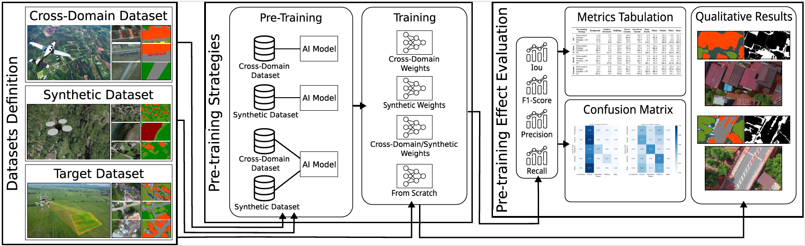

# A Study of Synthetic and Cross-Domain Real-Data Pre-Training for Aerial Farm Monitoring

| [Paper](https:) | 
| -------------------------------------------------- |

Welcome to the repository for our paper “A Study of Synthetic and Cross-Domain Real-Data Pre-Training for Aerial Farm Monitoring”, accepted at 38th Conference on Graphics, Patterns and Images, SIBGRAPI, 2025.

[]

> Overview of our method, which is divided into three steps: Datasets definition, Pre-training strategies, and Pre-training effect evaluation.

If you find this work useful for your research, please cite our paper:

```bibtex
@inproceedings{Ferreira2024,
    title        = {A Study of Synthetic and Cross-Domain Real-Data Pre-Training for Aerial Farm Monitoring},
    author       = {Ferreira, Juliana Q. and Silva, Lucas and Gomes, Antônio and Rodrigues, Larissa and Gomes, Thiago L. and Silva, Michel Melo},
    year         = 2025,
    booktitle    = {Proceedings of the 38th SIBGRAPI Conference on Graphics, Patterns and Images},
    organization = {SIBGRAPI},
    url          = {}
}

```
## Contact

### Authors

| [Juliana Quintiliano Ferreira](https://github.com/JulianaQuintiliano) | [Lucas Silva](https://github.com/Lucas-silva23) | [Antônio Gomes](https://github.com/Antoniogs1) | [Larissa Rodrigues](https://github.com/larissafrodrigues) | [Thiago L. Gomes](https://github.com/thiagoluange) | [Michel Melo Silva](https://michelmelosilva.github.io/) |
| :---------------------------------------------------------------: | :------------------------------------------: | :------------------------------------------: | :----------------------------------------------: | :-----------------------------------------------: | :--------------------------------------------------: |
| MSc. Student¹ | BSc. Student¹ | BSc. Student¹ | Assistant Professor² | Assistant Professor¹ | Assistant Professor¹ |
| <juliana.q.ferreira@ufv.br> | <lucas.silva23@ufv.br> | <antonio.g.gomes@ufv.br> | <larissa.f.rodrigues@ufv.br> | <thiago.luange@ufv.br> | <michel.m.silva@ufv.br> |

¹Universidade Federal de Viçosa  
Departamento de Informática  
Viçosa, Minas Gerais, Brazil  

²Instituto de Ciências Exatas e Tecnológicas  
Universidade Federal de Viçosa  
Rio Paranaíba, Minas Gerais, Brazil


### Laboratory

| [](https://mavilab-ufv.github.io/) | [](https://www.ufv.br/) |
| --------------------------------------------------------------------------------------------------------------------------------------------------------------------------- | ------------------------------------------------------------------- |

**MaVILab**: Machine Vision and Intelligence Laboratory \
 <https://mavilab-ufv.github.io>

## Acknowledgements

 We are grateful to CAPES, FAPEMIG, CNPq (CNPq/ MCTI/FNDCT Nº 18/2021), Instituto de Inteligência Artificial e Computacional (Idata-UFV), FINEP (IA-AD-UFV \#0284/22), Cluster/UFV, and EMBRAPA Café (ConCafé \#10.24.22.032.00.00/337 - supervisor Williams Ferreira), for supporting this project.